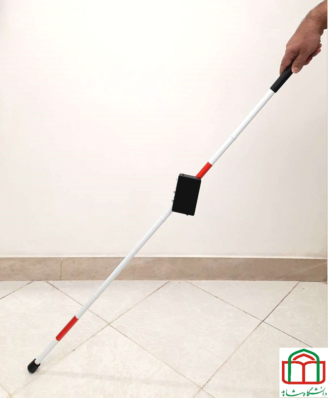

# Design and implementation of a warning system for approaching objects to the white cane of the blind

By  Sepehr Farahani and [M. B. Ghaznavi-Ghoushchi](https://github.com/ghoushchi).

In this repository, we released ALL the codes and design details of an Smart Cane to promote safer accessibility and inclusion for people with such disabilities and to help in support their independence and mobility. 

Note: If you see problems in max/nst due to fonts (with un-readable fonts or extra font sizes), you must recheck the fonts installation step again with care.

# Related Projects
Please follow us to be informed about related projects:

<a href="https://github.com/yarpose" rel="nofollow noreferrer">

  <a href="https://www.linkedin.com/in/ghaznavi-ghoushchi" rel="nofollow noreferrer">
     M. B. Ghaznavi-Ghoushchi
  </a> &nbsp; 
  <a href="https://github.com/ghoushchi" rel="nofollow noreferrer">
     ghoushchi
  </a>

